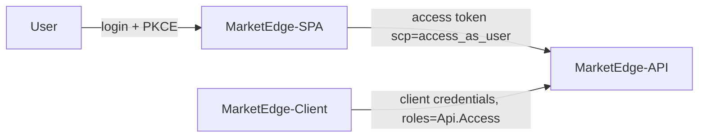

# Authentication

MarketEdge supports **Azure Entra ID (Azure AD)** authentication for both interactive
users and direct (service-to-service) API access. Auth is **off by default** and is
controlled entirely from configuration, so the app runs locally with zero setup and
can be pointed at any tenant without code changes.

## Overview

Two token flows are supported, backed by three app registrations:

| App registration    | Purpose                                                                 |
|---------------------|-------------------------------------------------------------------------|
| **MarketEdge-API**  | The protected Web API. Exposes the delegated scope `access_as_user` (user sign-in) and the app role `Api.Access` (client-credentials). Token audience `api://<api-client-id>`. |
| **MarketEdge-SPA**  | The React app (public client). Signs users in and calls the API on their behalf. Pre-authorized on the API so there is no consent prompt. |
| **MarketEdge-Client** | A confidential "daemon" client (client id + secret) for scenarios that call the API directly. Granted the `Api.Access` app role. |



The API accepts a request if the token carries **either** the required delegated scope
(user via SPA) **or** the required app role (daemon). This is enforced globally by a
fallback authorization policy; every endpoint is protected unless marked
`[AllowAnonymous]` (only `GET /api/auth/config` is).

## One-time setup (per tenant)

Run the setup script with the [Microsoft Graph PowerShell SDK]. It creates/updates all
three apps, exposes the scope and app role, wires SPA redirect URIs, pre-authorizes the
SPA, generates the daemon secret, and grants admin consent. It is idempotent.

```powershell
# Creates the apps and prints the resulting config + daemon secret
.\scripts\Setup-EntraApps.ps1 -TenantId contoso.onmicrosoft.com

# ...or also write the AzureAd settings straight into appsettings.Development.json
.\scripts\Setup-EntraApps.ps1 -TenantId contoso.onmicrosoft.com -WriteConfig

# Custom redirect URIs (add your production origin)
.\scripts\Setup-EntraApps.ps1 -TenantId contoso.onmicrosoft.com `
    -SpaRedirectUris 'http://localhost:5173','https://marketedge.contoso.com'
```

You must run this as a user who can consent to `Application.ReadWrite.All`,
`AppRoleAssignment.ReadWrite.All`, and `DelegatedPermissionGrant.ReadWrite.All`
(typically a tenant admin). The **daemon client secret is printed only once** — store it
somewhere safe (it is intentionally *not* written to the repo).

[Microsoft Graph PowerShell SDK]: https://learn.microsoft.com/powershell/microsoftgraph/installation

## Configuration

All settings live in the API's `AzureAd` config section. This is the single source of
truth — the SPA fetches what it needs at runtime from `GET /api/auth/config`, so there
is nothing to rebuild when switching tenants.

```jsonc
"AzureAd": {
  "Enabled": true,                          // master switch (false = no auth)
  "Instance": "https://login.microsoftonline.com/",
  "TenantId": "<tenant-id>",
  "ClientId": "<MarketEdge-API client id>",  // token audience
  "SpaClientId": "<MarketEdge-SPA client id>",
  "Scopes": "access_as_user",               // required delegated scope(s)
  "AppRoles": "Api.Access"                   // required app role(s)
}
```

No secrets are stored in the API — it only validates tokens. The daemon's client id and
secret belong to whatever process calls the API, not to the API itself.

### Disabling auth

Set `AzureAd:Enabled` to `false` (the default). The API registers no JWT scheme and no
fallback policy, the SPA skips MSAL entirely, and requests are sent without a token —
identical to the pre-auth behaviour. This is the recommended setting for local
development and is what the automated tests run with.

## User sign-in (SPA)

When auth is enabled, the SPA reads `/api/auth/config`, initialises MSAL, and requires an
interactive login (auth code + PKCE) before rendering. Access tokens are acquired
silently and attached as `Authorization: Bearer <token>` to every API call. A sign-out
control appears in the top nav. When auth is disabled the app renders immediately with no
login.

## Direct API access (client credentials)

For non-interactive callers, request an app-only token from the tenant token endpoint
using the daemon client id + secret, then call the API with it:

```bash
# 1. Get a token
curl -X POST "https://login.microsoftonline.com/<tenant-id>/oauth2/v2.0/token" \
     -d "grant_type=client_credentials" \
     -d "client_id=<MarketEdge-Client client id>" \
     -d "client_secret=<daemon secret>" \
     -d "scope=api://<MarketEdge-API client id>/.default"

# 2. Call the API
curl "https://<api-host>/api/india/sectors" \
     -H "Authorization: Bearer <access_token>"
```

The token contains `roles: ["Api.Access"]`, which satisfies the API's authorization
policy.

## Switching tenants

1. Re-run `Setup-EntraApps.ps1 -TenantId <new-tenant>` (optionally `-WriteConfig`).
2. Update the API's `AzureAd` section with the printed values (or let `-WriteConfig` do it).
3. Restart the API. The SPA picks up the new settings automatically — no rebuild.

## Swagger

In Development, Swagger UI shows an **Authorize** button. Paste a raw JWT (user or
client-credentials) to call protected endpoints interactively.
